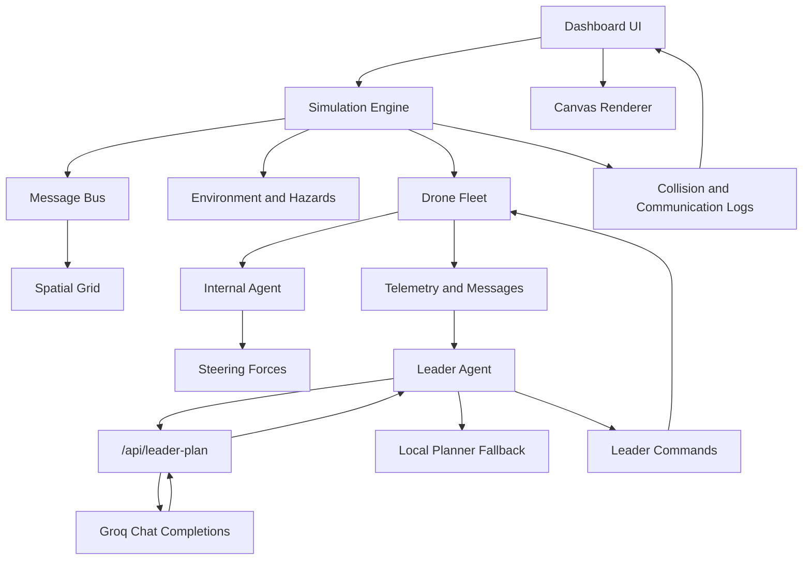
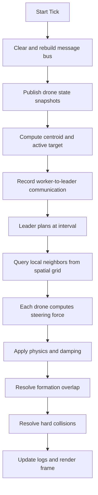

# Virtual Swarm Drone Coordination

Virtual Swarm Drone Coordination is an interactive React and TypeScript simulation for experimenting with coordinated drone swarm behavior, formation control, leader-worker communication, environmental hazards, collision recovery, and AI-assisted mission planning.

The project is designed as a small swarm coordination lab rather than a simple visual flocking sketch. Each drone behaves as an autonomous local agent, while a leader drone can analyze telemetry, issue high-level mission commands, and optionally use a Groq-hosted model as the strategic planner.

Live simulation: [https://sayon999-d.github.io/Virtual-Swarm-Drone-Coordination/](https://sayon999-d.github.io/Virtual-Swarm-Drone-Coordination/)

Important deployment note:

The GitHub Pages version is a static frontend deployment. Static hosting cannot safely store or use a private Groq API key at runtime. The Groq-backed `/api/leader-plan` route works when the app is run with a server, such as the local Vite dev server or another deployment platform with backend/serverless support. On GitHub Pages, the simulation should rely on local fallback planning unless you connect it to a separate secure backend proxy.

## What Makes This Simulation Different

Many browser-based drone or swarm demos focus on the visual effect of particles moving together. They usually show separation, cohesion, alignment, or target following. This project goes further by modeling the swarm as a coordinated system with multiple layers of decision-making.

The main differences are:

1. Leader-worker architecture

   One drone is treated as the leader. It receives reports from the worker drones, analyzes the swarm state, and broadcasts a strategic command back to the swarm.

2. Groq-first strategic planning

   The leader can ask a Groq model to choose a mission-level command. The model is not responsible for frame-by-frame movement. It only decides strategy.

3. Local fallback planner

   If Groq is not configured, rate-limited, offline, or unavailable, the local planner continues issuing safe commands so the simulation does not freeze.

4. Visible agent communication

   The Leader panel shows what the worker drones are trying to communicate: status reports, low energy warnings, hazard alerts, and distress messages.

5. Formation stability logic

   Structured formations use safe spacing, slot assignment, braking near assigned slots, separation pressure, and overlap recovery. Drones do not simply teleport into perfect positions.

6. Hazard-aware decisions

   Obstacles affect movement, energy, health, and command decisions. Hazards are part of the simulation state, not only visual decoration.

7. Scalable local perception

   Drones use a spatial grid to query local neighbors instead of comparing against every other drone every frame.

8. Hybrid AI control loop

   The model decides high-level intent. The simulation engine handles local physics, collisions, routing pressure, and formation stabilization.

This makes the project closer to a prototype for AI-assisted swarm coordination than a basic animation.

## High-Level Concept

The system is built around a hierarchy:

```text
Leader drone
  receives telemetry from worker drones
  asks Groq for strategic planning when available
  falls back to local planning when needed
  broadcasts one high-level command

Worker drones
  sense local state
  report status or hazards
  react to neighbors
  follow formation slots
  avoid collisions and obstacles
```

The important design choice is that the leader does not directly control every movement of every drone. That would make the system brittle and unrealistic. Instead, the leader sets mission intent, and every drone still uses local steering rules to remain safe.

## Runtime Architecture



## Core Runtime Loop

Each simulation tick follows this general process:



This separation lets the swarm remain responsive without asking the AI model for a decision every animation frame.

## Leader Brain

The leader can issue one of five high-level commands:

| Command | Meaning |
| --- | --- |
| `HOLD_FORMATION` | Keep the current formation stable |
| `REGROUP` | Pull the swarm closer together |
| `EXPAND_SEARCH` | Let scouts widen coverage |
| `AVOID_HAZARDS` | Prioritize obstacle avoidance and safe spacing |
| `CONSERVE_ENERGY` | Reduce wasteful movement and protect low-energy drones |

The leader command affects the simulation by adjusting local steering pressure, target pressure, cohesion, separation, and hazard avoidance.

## Groq Integration

The project includes a server-side Vite development route:

```text
/api/leader-plan
```

This route reads `GROQ_API_KEY` from the server environment and calls Groq's OpenAI-compatible chat completions endpoint.

The frontend never receives the API key.

### Local Environment

Create a local `.env` file:

```env
GROQ_API_KEY="your_groq_api_key"
GROQ_MODEL="llama-3.1-8b-instant"
```

Recommended model:

```text
llama-3.1-8b-instant
```

This model is preferred because it uses fewer tokens and is less likely to hit token-per-minute limits.

The larger model:

```text
llama-3.3-70b-versatile
```

can work, but it is easier to hit on-demand tier rate limits.

### Rate Limit Handling

If Groq returns a rate-limit error, the simulation does not stop. It:

1. marks Groq as fallback in the UI
2. keeps using the local planner
3. waits for a cooldown period
4. tries Groq again later

The request payload is compacted before it is sent to Groq. Positions are rounded, velocity is reduced to speed, and output tokens are limited. This keeps the leader planning loop cheaper and more reliable.

## GitHub Pages and API Keys

GitHub Pages is static hosting. It can serve HTML, CSS, JavaScript, and assets, but it does not run a private backend process for your app.

That means:

```text
GitHub Pages can host the simulation UI.
GitHub Pages cannot safely host the Groq API key at runtime.
GitHub Actions secrets are available during build, not after the static site is published.
```

Adding `GROQ_API_KEY` as a GitHub Actions secret would not solve runtime Groq access for GitHub Pages. The secret would be available during the build job, but the deployed site would still be static JavaScript running in the user's browser.

You should not expose the Groq key as a `VITE_*` variable. Any `VITE_*` variable can be bundled into browser JavaScript and seen by users.

### Deployment Options for Groq

If you want Groq to work in a hosted production version, use one of these options:

1. Deploy to a platform with serverless functions

   Examples:

   - Vercel
   - Netlify Functions
   - Cloudflare Workers
   - Azure Static Web Apps
   - Render
   - Fly.io

2. Keep GitHub Pages for the frontend and deploy a separate backend proxy

   The frontend calls your backend:

   ```text
   GitHub Pages frontend -> secure backend proxy -> Groq API
   ```

3. Use local fallback only on GitHub Pages

   This keeps the public demo safe and functional without any private API key.

The current GitHub Pages deployment is best treated as a static demo with local fallback. The Groq route is meant for local development or a server-backed deployment.

## Agent Communication Feed

The Leader panel includes a communication feed that shows what the worker drones are reporting to the leader.

Message types include:

| Message | Meaning |
| --- | --- |
| `STATUS_REPORT` | Routine worker telemetry |
| `LOW_ENERGY` | Drone asks for energy-aware routing |
| `DISTRESS` | Drone reports low health |
| `HAZARD_DETECTED` | Drone warns about nearby danger |
| `LEADER_COMMAND` | Command broadcast through the message system |

The feed is useful because it makes the coordination loop visible:

```text
worker reports state
leader analyzes reports
leader chooses command
swarm reacts
```

## Drone Roles

Each drone has a profile that changes its movement and decision behavior.

| Role | Purpose | Behavior |
| --- | --- | --- |
| `Scout` | Explore and detect hazards | Faster, wider perception, more energy use |
| `Defender` | Stabilize and protect | Slower, stronger separation, higher health |
| `Worker` | Hold structure | Efficient, formation-focused, low wander |
| `Relay` | Improve coordination | Stronger response to communication signals |

The leader drone is assigned as a `Relay`, which fits the command-and-communication role.

## Formation System

The simulation supports multiple formations:

| Formation | Purpose |
| --- | --- |
| `Scatter` | Loose independent motion |
| `Flock` | Classic flocking behavior |
| `Grid` | Structured slot-based arrangement |
| `V-Shape` | Leader-forward formation |
| `Circle` | Ring formation around the center |
| `Leader` | Line behind a lead direction |
| `Hexagon` | Compact multi-layer packing |
| `Cross` | Diagonal branch formation |

Formation stability uses several mechanisms:

1. Safe minimum spacing

   The spacing floor is high enough to avoid drones fighting the near-collision zone while they are technically in formation.

2. Nearest-slot assignment

   Formation slots are assigned to nearby drones rather than by raw array index.

3. Velocity damping on reassignment

   When a new formation is chosen, drones reduce velocity so they do not rush through neighboring slots.

4. Near-slot braking

   Drones slow down as they approach their assigned positions.

5. Overlap resolution

   If drones still overlap after movement, the simulation separates them and reduces sticking.

6. Separation pressure

   Formation mode increases separation so drones preserve physical space.

These mechanisms make formations more stable while still keeping the motion visibly autonomous.

## Steering Model

Every drone computes steering from several forces:

| Force | Description |
| --- | --- |
| Separation | Avoid nearby drones |
| Alignment | Match nearby heading |
| Cohesion | Stay connected to local group |
| Formation Target | Move toward assigned formation slot |
| Obstacle Avoidance | Repel from hazards and blocks |
| Wander | Add controlled randomness |
| Communication Response | React to drone messages and leader commands |

The simulation integrates these forces into acceleration, velocity, position, rotation, pitch, and roll.

## Hazards and Obstacles

The environment includes:

| Hazard | Effect |
| --- | --- |
| `circle` | Basic radial keep-out pillar |
| `rect` | Box-shaped obstacle |
| `electrical_storm` | Damages health and destabilizes movement |
| `magnetic_field` | Drains energy and slows drones |

Hazards influence:

- local obstacle avoidance
- drone health
- drone energy
- hazard messages
- leader decisions
- collision risk

## Collision Handling

The simulator tracks both near-collisions and direct collisions.

Near-collisions:

- mark drones as unstable
- increase local separation pressure
- can trigger hazard messages
- show warning visuals on the canvas

Direct collisions:

- push overlapping drones apart
- damp velocity
- record collision events
- update the collision log
- show visual impact effects

This makes the swarm self-correcting instead of permanently unstable after one bad interaction.

## Dashboard

The dashboard acts as the operator console.

Main areas:

| Panel | Purpose |
| --- | --- |
| Config | Formation, spacing, swarm size, autopilot, trails, hazards |
| Leader | Groq/local brain status, leader command, worker messages |
| Logs | Collision and incident feed |
| Inspect | Per-drone telemetry and health details |

The canvas supports:

- click to set target
- shift-click to place hazards
- drag obstacles
- wheel zoom
- pan with middle click or Alt-drag
- double-click to fit the simulation back into view

## State Persistence

The app can save and load mission state through browser `localStorage`.

Saved state includes:

- current tick
- formation
- behavior mode
- spacing
- movement configuration
- autopilot waypoints
- active waypoint index
- obstacles
- drone positions
- drone velocities
- energy and health
- role profile
- target offsets

This is useful for repeatable experiments and demos.

## Local Development

### Requirements

- Node.js 20 or newer
- npm
- optional Groq API key for server-backed leader planning

### Install dependencies

```bash
npm ci
```

### Run the app

```bash
npm run dev
```

Vite usually starts at:

```text
http://localhost:3000/
```

If that port is already in use, Vite will choose another port such as `3001` or `3002`.

### Run checks

```bash
npm run lint
npm run build
```

`npm run lint` runs TypeScript checking with `tsc --noEmit`.

`npm run build` creates the production Vite bundle.

## Project Structure

```text
src/
  App.tsx
  main.tsx
  index.css
  swarm/
    agents/
      Drone.ts
    communication/
      MessageBus.ts
    control/
      SwarmConfig.ts
    environment/
      Environment.ts
    internal_agent/
      InternalAgent.ts
    leader/
      LeaderAgent.ts
    simulation/
      Simulation.ts
    spatial_index/
      SpatialGrid.ts
    utils/
      Vector2.ts
    visualization/
      CanvasRenderer.tsx
      Dashboard.tsx
```

## GitHub Pages Deployment

The project deploys the static frontend through GitHub Actions.

GitHub Pages should be configured as:

```text
Settings -> Pages -> Build and deployment -> Source -> GitHub Actions
```

Deployment workflow:

1. Push to `main`.
2. GitHub Actions installs dependencies with `npm ci`.
3. TypeScript checks run.
4. Vite builds the app.
5. The `dist/` directory is uploaded as a Pages artifact.
6. GitHub Pages publishes the artifact.

The workflow file is:

```text
.github/workflows/deploy-pages.yml
```

The workflow also validates pull requests with lint and build checks.

## Deployment Workflow Details

The workflow has three logical stages:

1. `validate`

   Runs on pull requests and pushes.

   It performs:

   - checkout
   - Node.js setup
   - dependency installation
   - TypeScript check
   - production build

2. `build`

   Runs only outside pull requests.

   It builds the static Pages artifact.

3. `deploy`

   Runs only outside pull requests.

   It deploys the uploaded artifact to GitHub Pages.

This prevents pull requests from deploying while still validating that they build correctly.

## Practical Experiments

Try these scenarios:

1. Start in `Scatter`, then switch to `V-Shape`.
2. Open the Leader panel and watch status reports from workers.
3. Place an `electrical_storm` near the formation path.
4. Watch hazard reports appear in Agent Communications.
5. Switch to `Grid` and lower/raise spacing to observe stability.
6. Enable Auto Pilot and place obstacles near a waypoint.
7. Configure Groq locally and compare Groq commands against local fallback.
8. Trigger a Groq rate limit and confirm the local fallback remains active.
9. Save a stable state, disturb the environment, then reload the state.
10. Increase drone count and inspect how spatial indexing keeps neighbor queries practical.

## Current Limitations

- GitHub Pages cannot securely run the Groq API route.
- Groq calls are intentionally low-frequency to avoid rate limits.
- The physics is simplified and designed for visual simulation, not real drone flight.
- Formations are 2D canvas formations, not real-world 3D trajectories.
- The leader makes high-level decisions only; low-level motion remains local.

## Future Improvements

Possible next steps:

- serverless production deployment for Groq-backed planning
- richer mission objectives
- terrain and altitude layers
- separate communication range simulation
- replay/export of mission logs
- stronger formation assignment algorithms
- real-time charting of energy and health
- configurable Groq model and planning interval from the UI
- multi-leader or backup-leader behavior
- obstacle-aware path planning before slot assignment

## Summary

Virtual Swarm Drone Coordination demonstrates a layered approach to swarm simulation:

```text
local drone physics
+ neighbor communication
+ formation control
+ hazard response
+ leader command planning
+ optional Groq model reasoning
+ local fallback safety
```

The result is a simulation where drones are not just moving dots. They are worker agents reporting to a leader, reacting to local conditions, preserving formation safety, and adapting to mission-level commands.
